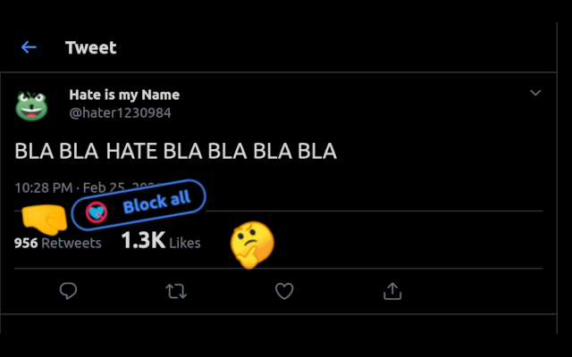
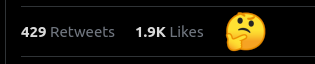
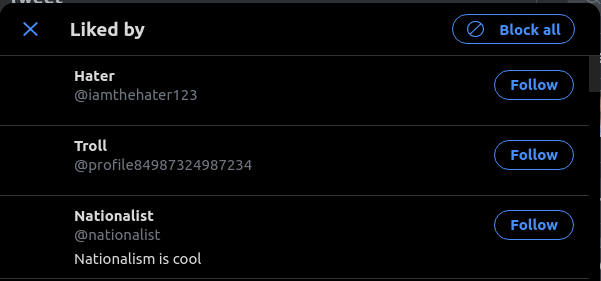
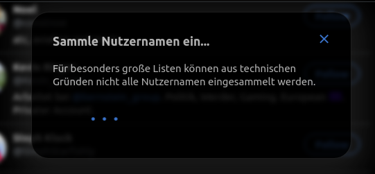
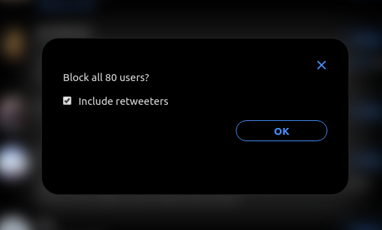

# Likers Blocker

A browser extension to block all visible likers of a tweet.

Inspired by [Mario Sixtus (@sixtus)](https://twitter.com/sixtus):

> In Übrigen wünsche ich mir für solche Fälle ein Twitter-Add-On, das alle Liker eines bestimmten Tweets blockt, weil es nur Arschlöcher sein können. Wer programmiert es?
> – [10:41 am · 22 Feb. 2020](https://twitter.com/sixtus/status/1231152136857231360)

In collaboration with [@pkreissel](https://twitter.com/pkreissel), who wrote the back-end for this tool: https://github.com/pkreissel/ichbinhier_twittertools.

## Installation

---

**NOTE:**
The Extension is currently in beta status. This means that it can not be considered as stable and there may be bugs. See [Issues](https://github.com/dmstern/likers-blocker/issues).

Since the extension is not yet available in the *Chrome Web Store* or on *Firefox Add-Ons*, you will have to install it manually. Please note that you won't get updates if you install the extension manually.

If you have problems with the installation, it's reccomended to wait until the extension is officially published (turn on notifications for [#19](https://github.com/dmstern/likers-blocker/issues/19)).

You can also test the extension locally, see [Development](#development) (this is only reccomended for advanced users).

---

### Google Chrome

* Download the latest release [here](https://github.com/dmstern/likers-blocker/releases/latest/download/likers-blocker.crx).
* In Chrome navigate to `chrome://extensions`.
* Turn on the developer mode (with the toggle button in the top right corner)
* Drag and drop the downloaded `.crx` file into the extensions page
* Confirm the installation.

### Mozilla Firefox

 * See [#Development](#development)

## Usage

* Once you click on a tweet, there is a link which indicates how many people liked this tweet.
* Click on that link to get the list of all likers

  
* Then click on the new button on the top which says "Block all" / "Alle Blockieren".
  
  
  
* You can also chose to block all retweeters of the tweet (only direct retweeters without comment).
* If you use it for the first time, you will have to authorize the app to access your twitter account.
* You get a list of all users that are about to be blocked.
* Confirm and wait for the sucess message.
* ✔ DONE. All the collected likers of the tweet are blocked. 😇

## Constraints

* For big lists of likers (hundrets and more), not *all* likers are blocked, we can only collect those who are visible in the list from twitter.

## Known Issues and ToDos

If you find a bug or want to suggest new features, [file a new issue](https://github.com/dmstern/likers-blocker/issues/new).

## Contribution

Feel free to suggest improvements or to create pull requests!

### Development

To test the extension locally:

* Clone this repository

#### Chrome

* Go to `chrome://extensions`
* Enable the developer mode with the regarding toggle button on the right side
* Click on "Load unpacked"
* Select the `src` folder of the cloned repository

#### Firefox

* Go `about:debugging#/runtime/this-firefox`
* Click on `Load Temorary Add-On...`
* Select any file of the cloned repository

---

All information on this site is licensed under the [Creative Commons Attribution-NonCommercial-ShareAlike 4.0 International License](http://creativecommons.org/licenses/by-nc-sa/4.0/).
