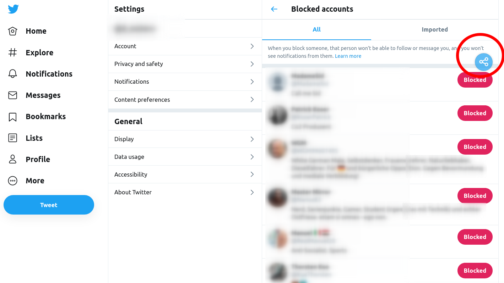
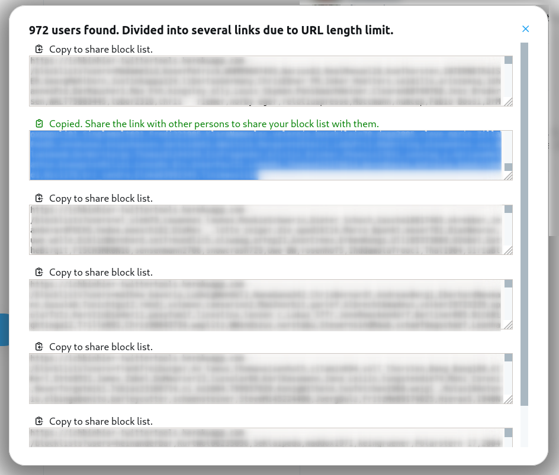

# Likers Blocker


A browser extension to block all visible likers (and optionally all retweeters) of a tweet on Twitter.


Inspired by [Mario Sixtus (@sixtus)](https://twitter.com/sixtus):

> In Übrigen wünsche ich mir für solche Fälle ein Twitter-Add-On, das alle Liker eines bestimmten Tweets blockt, weil es nur Arschlöcher sein können. Wer programmiert es?
> – [10:41 am · 22 Feb. 2020](https://twitter.com/sixtus/status/1231152136857231360)

In collaboration with [@pkreissel](https://twitter.com/pkreissel), who wrote the back-end for this tool: [https://github.com/pkreissel/ichbinhier_twittertools](https://github.com/pkreissel/ichbinhier_twittertools).

## Installation

[ Install for Mozilla Firefox](https://addons.mozilla.org/firefox/addon/likers-blocker/)

[ Install for Google Chrome](https://chrome.google.com/webstore/detail/melnbpmfhaejmcpfflfjmchondkpmkcj/)

[ Install for Opera](https://addons.opera.com/de/extensions/details/likers-blocker/)

[Install for Microsoft Edge](https://chrome.google.com/webstore/detail/melnbpmfhaejmcpfflfjmchondkpmkcj/) (You can install Chrome extensions in Edge, it's basically the same browser)

## Usage

### Block likers of a tweet

- Once you click on a tweet, there is a link which indicates how many people liked this tweet.
- Click on that link to get the list of all likers

  

- Then click on the new button on the top which says "Block all" / "Alle Blockieren".
  
  
- You can also chose to block all retweeters of the tweet (only direct retweeters without comment).
  
- If you use it for the first time, you will have to authorize the app to access your twitter account.
- You get a list of all users that are about to be blocked.
- Confirm and wait for the sucess message.
- ✔ DONE. All the collected likers of the tweet are blocked. 😇

### Block all members of a list

- Click on a list of twitter users
- Click on the number of members
- Proceed with point three above ("Block all")

### Share your block list with others

Since Twitter has disabled its ability to import/export block lists, _LikersBlocker_ brings back the feature.

#### Export

- Go to "Settings and privacy" > "Content preferences" > "Blocked accounts" (Or just go to https://twitter.com/settings/blocked/all)
- Click on the share button above the list of blocked accounts
  
- Wait a moment until all acocunts from your list are collected (make sure to leave the tab in the foreground to avoid stoping the automatic down scrolling)
- Copy and share the block links with other persons to share your block list with them.
  

#### Import

- When you receive a block link, just click on it or enter it into the address bar of your browser.
- If you use it for the first time, you will have to authorize the app to access your twitter account.
- You get a list of all users that are about to be blocked.
- Confirm and wait for the sucess message.
- ✔ DONE. All the collected likers of the tweet are blocked. 😇

## Known Issues and ToDos

If you find a bug or want to suggest new features, [file a new issue](https://github.com/dmstern/likers-blocker/issues/new).

## Contribution

Feel free to suggest improvements or to create pull requests!

To test the extension locally:

- Clone this repository

### Build

- Install Node.js 14.x

In the repository directory, run:

```bash
npm install
```

```bash
npm run build
```

### Run

#### Chrome

- Go to `chrome://extensions`
- Enable the developer mode with the regarding toggle button on the right side
- Click on "Load unpacked"
- Select the `dist` folder of the cloned repository

#### Firefox

- Go `about:debugging#/runtime/this-firefox`
- Click on `Load Temorary Add-On...`
- Select any file in the `dist` folder of the cloned repository

---

[](http://creativecommons.org/licenses/by-nc-sa/4.0/)
All information on this site is licensed under the [Creative Commons Attribution-NonCommercial-ShareAlike 4.0 International License](http://creativecommons.org/licenses/by-nc-sa/4.0/).

## Support

Glad that you appreciate our work! :)

We do this in our free time. This tool is and remains free for everyone and free from ads.
We would highly appreciate if you considered donating a little tip, rate this extension in your browser or tell others about it.

### Donate

- 💝 [paypal.me/dmstr](https://paypal.me/dmstr)
- 💝 [paypal.me/philipkreissel](https://paypal.me/philipkreissel)

### Rate

⭐⭐⭐⭐⭐ Rate this extension in the [Chrome Web Store](https://chrome.google.com/webstore/detail/melnbpmfhaejmcpfflfjmchondkpmkcj/), on [Firefox Add-Ons](https://addons.mozilla.org/firefox/addon/likers-blocker/), [Opera Add-Ons](https://addons.opera.com/de/extensions/details/likers-blocker/).

### Share

[🐦 💬 Tweet about this extension](<https://twitter.com/share?text=With the @LikersBlocker you can block people that like hate speech.&url=https://dmstern.github.io/likers-blocker&hashtags=LikersBlocker,sayNoToHateSpeech,ichbinhier>)

### Follow us on Twitter

💬 Don't miss version updates or bugfixes and join the conversation!

[  @LikersBlocker](https://twitter.com/LikersBlocker)

[  @pkreissel](https://twitter.com/pkreissel) (Backend)

[  @d_mstern](https://twitter.com/d_mstern) (Frontend)
