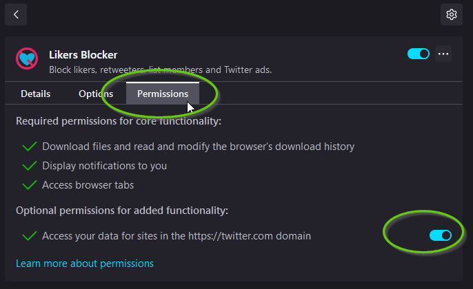
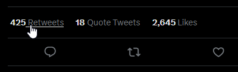

# Likers Blocker

A browser extension to block likers, retweeters, list members and Twitter ads and share your block lists with others.

Inspired by [Mario Sixtus (@sixtus)](https://twitter.com/sixtus):

> In Übrigen wünsche ich mir für solche Fälle ein Twitter-Add-On, das alle Liker eines bestimmten Tweets blockt, weil es nur Arschlöcher sein können. Wer programmiert es?
> – [10:41 am · 22 Feb. 2020](https://twitter.com/sixtus/status/1231152136857231360)

## Installation

[ Install for Mozilla Firefox](https://addons.mozilla.org/firefox/addon/likers-blocker/)

[ Install for Google Chrome](https://chrome.google.com/webstore/detail/melnbpmfhaejmcpfflfjmchondkpmkcj/)

[ Install for Opera](https://addons.opera.com/de/extensions/details/likers-blocker/)

[Install for Microsoft Edge](https://microsoftedge.microsoft.com/addons/detail/likers-blocker/fpcekgmidebefplhmglkndcbepplhkkb)

## Usage

---

⚠️ **IMPORTANT:** If you use Firefox, please right-click the extension icon, click "manage extension", go to "Permissions" and enable all permissions to make sure the extension works.

---

### Block likers or retweeters of a tweet

- Once you click on a tweet, there is a link which indicates how many people liked this tweet.
- Click on that link to get the list of all likers (or, to block the retweeters on the "retweeters" count)

  
  

- Then click on the new button on the top which says "Block all", wait until Likers Blocker has collected all accounts (or skip if a smaller portion is fine for you ) and confirm to add the users to the blocking queue.
  
- ✔ DONE. LikersBlocker will process the blocking queue bit by bit in the background.
  You can find the status of the blocking queue by clicking on the extension icon in the upper right corner of your browser.
  

### Block all members or followers of a list

- Click on a list of twitter users
- Click on the number of members (or followers)
- Proceed with point three above ("Block all")

### Preferences

### Import / Export

#### Only blocked by LikersBlocker

- Go to the extension options by clicking on the options button in the bottom right corner of the extension popup:

  
- On the top of the options page you can find a file select button to import a CSV file and an export button to export your block list. This will download a CSV file with all accounts that were blocked by the extension.

#### All blocked from Twitter settings

- _Alternatively_, you can "visually" collect all previously blocked accounts by clicking on the first link on the options page (which opens the [Twitter settings](https://twitter.com/settings/blocked/all)) and then on the share button.
  
- Wait a moment until all accounts from your list are collected (make sure to leave the tab in the foreground to avoid stopping the automatic down scrolling)
  
- After the collecting you can download the CSV file which includes all collected blocked accounts
  

## Found an error or want to suggest a feature?

If you find a bug or want to suggest new features, please [file a new issue](https://github.com/dmstern/likers-blocker/issues/new).

## Contribution

see [CONTRIBUTION.md](CONTRIBUTION.md).

## Support

Glad that you appreciate our work! 😃

We do this in our free time. This tool is and remains free for everyone and free from ads.
We would highly appreciate if you considered donating a little tip, rate this extension in your browser or tell others about it.

### Donate

- 💝 **[paypal.me/dmstr](https://paypal.me/dmstr)**
- 💝 **[paypal.me/philipkreissel](https://paypal.me/philipkreissel)**

### Rate

⭐⭐⭐⭐⭐ Rate this extension in the [Chrome Web Store](https://chrome.google.com/webstore/detail/melnbpmfhaejmcpfflfjmchondkpmkcj/), on [Firefox Add-Ons](https://addons.mozilla.org/firefox/addon/likers-blocker/), [Opera Add-Ons](https://addons.opera.com/de/extensions/details/likers-blocker/), [Edge Add-Ons](https://microsoftedge.microsoft.com/addons/detail/likers-blocker/fpcekgmidebefplhmglkndcbepplhkkb).

### Share

[🐦 Tweet about this extension](https://twitter.com/share?text=With%20the%20@LikersBlocker%20you%20can%20block%20people%20that%20like%20hate%20speech.&url=https://dmstern.github.io/likers-blocker&hashtags=LikersBlocker,sayNoToHateSpeech) and tell your friends!

### Follow us on Twitter

💬 Don't miss version updates or bugfixes and join the conversation!

[  @LikersBlocker](https://twitter.com/LikersBlocker)

<a href="https://twitter.com/pkreissel"> @pkreissel</a>

<a href="https://twitter.com/d_mstern"> @d_mstern</a>

---

All information on this site is licensed under the [Creative Commons Attribution-NonCommercial-ShareAlike 4.0 International License](http://creativecommons.org/licenses/by-nc-sa/4.0/).

