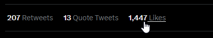
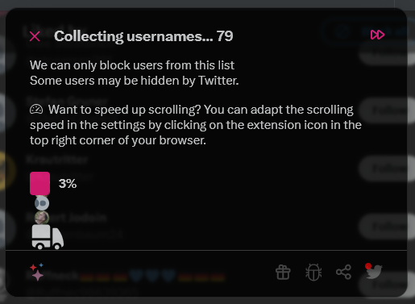

# Likers Blocker

A browser extension to block all visible likers (and optionally all retweeters) of a tweet on Twitter.

Inspired by [Mario Sixtus (@sixtus)](https://twitter.com/sixtus):

> In Übrigen wünsche ich mir für solche Fälle ein Twitter-Add-On, das alle Liker eines bestimmten Tweets blockt, weil es nur Arschlöcher sein können. Wer programmiert es?
> – [10:41 am · 22 Feb. 2020](https://twitter.com/sixtus/status/1231152136857231360)

In collaboration with [@pkreissel](https://twitter.com/pkreissel), who wrote the back-end for this tool: [https://github.com/pkreissel/ichbinhier_twittertools](https://github.com/pkreissel/ichbinhier_twittertools).

## Installation

[ Install Add-On for Mozilla Firefox](https://addons.mozilla.org/firefox/addon/likers-blocker/)

[ Install Extension for Google Chrome](https://chrome.google.com/webstore/detail/melnbpmfhaejmcpfflfjmchondkpmkcj/)

## Usage

* Once you click on a tweet, there is a link which indicates how many people liked this tweet.
* Click on that link to get the list of all likers

  
* Then click on the new button on the top which says "Block all" / "Alle Blockieren".
  
  
* You can also chose to block all retweeters of the tweet (only direct retweeters without comment).
  
* If you use it for the first time, you will have to authorize the app to access your twitter account.
* You get a list of all users that are about to be blocked.
* Confirm and wait for the sucess message.
* ✔ DONE. All the collected likers of the tweet are blocked. 😇

## Constraints

* For big lists of likers (hundrets and more), not *all* likers are blocked, we can only collect those who are visible in the list from twitter.

## Known Issues and ToDos

If you find a bug or want to suggest new features, [file a new issue](https://github.com/dmstern/likers-blocker/issues/new).

## Contribution

Feel free to suggest improvements or to create pull requests!

### Development

To test the extension locally:

* Clone this repository

#### Chrome

* Go to `chrome://extensions`
* Enable the developer mode with the regarding toggle button on the right side
* Click on "Load unpacked"
* Select the `src` folder of the cloned repository

#### Firefox

* Go `about:debugging#/runtime/this-firefox`
* Click on `Load Temorary Add-On...`
* Select any file in the `src` folder of the cloned repository

---

All information on this site is licensed under the [Creative Commons Attribution-NonCommercial-ShareAlike 4.0 International License](http://creativecommons.org/licenses/by-nc-sa/4.0/).
